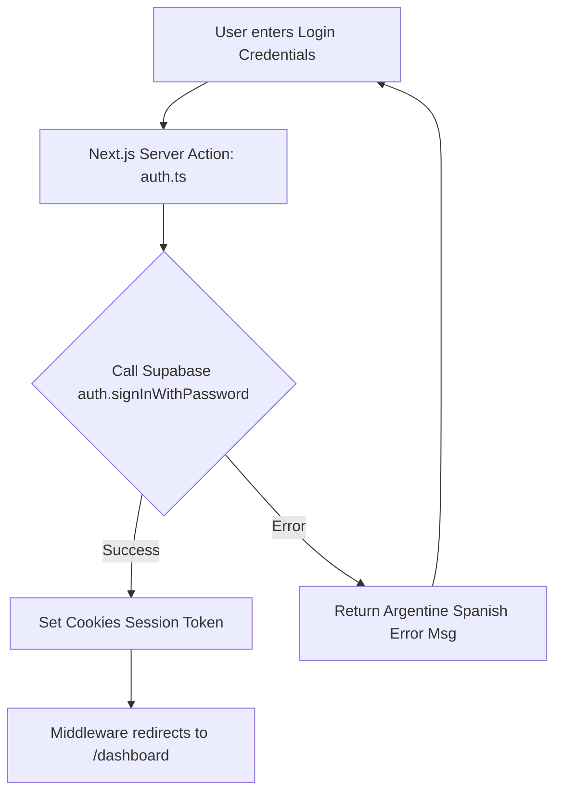

# Workflow: Authentication & Verification

This workflow details the step-by-step process of adding or verifying authentication functionality within UNLaR-Connect.

## Step-by-Step Implementation Recipe

### 1. Build the Form Views (`src/app/(auth)/login/page.tsx`)
- Implement a responsive, card-based form with Outfit headings.
- Enforce client-side inputs verification.
- Localize all fields into Argentine Spanish:
  - *Email field*: "Correo electrónico" / "Tu email de la UNLaR"
  - *Password field*: "Contraseña" / "Tu clave secreta"

### 2. Define the Server Actions (`src/actions/auth.ts`)
- Use `"use server"`.
- Validate fields schemas using Zod.
- Call the Supabase auth SDK.
- Catch authentication error codes (e.g. invalid credentials) and convert them to Argentine Spanish:
  - *Example*: "Che, las credenciales que ingresaste no son correctas. Verificá los datos e intentalo de nuevo."

### 3. Middleware Route Guards (`src/middleware.ts`)
- Verify session cookies before displaying any layout under `/dashboard`, `/apuntes`, `/foros`, or `/tutorias`.
- Redirect unauthenticated requests to `/login`.

### 4. Verification Check
- Use mock credentials to test registration and login flow.
- Ensure unauthorized page access correctly triggers an automatic redirect.
