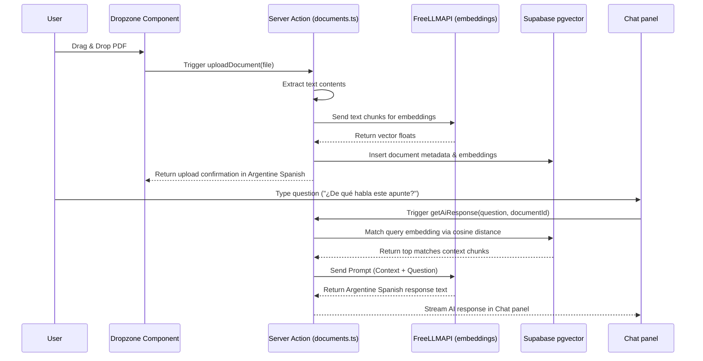

# Workflow: RAG Feature & PDF Assistant Integration

This workflow details the step-by-step process of integrating new RAG capabilities, such as attaching files to chat panels.

## Step-by-Step Implementation Recipe

### 1. Dropzone PDF UI (`src/components/documents/Dropzone.tsx`)
- Build a beautiful, responsive, dashed-border dropzone area using the `bg-glass` class.
- Add micro-animations when dragging files (`scale-[1.01]` + teal border glow).
- Copy in Argentine Spanish: "Arrastrá tu apunte acá o hacé clic para buscar el archivo PDF (Máx. 10MB)".

### 2. Processing Server Actions (`src/actions/documents.ts` & `embeddings.ts`)
- Implement `uploadDocument(formData: FormData)`.
- Use a lightweight server-side parser to extract text.
- Divide text into chunk nodes.
- Make internal server action fetch calls to FreeLLMAPI `/embeddings` endpoint.
- Store embeddings in database.

### 3. Verification Checklist
- Upload a standard syllabus or note PDF.
- Verify chunks are properly created in `document_embeddings` table.
- Submit a query to the chat window and confirm the AI retrieves the matching chunks and responds in friendly Argentine Spanish.
