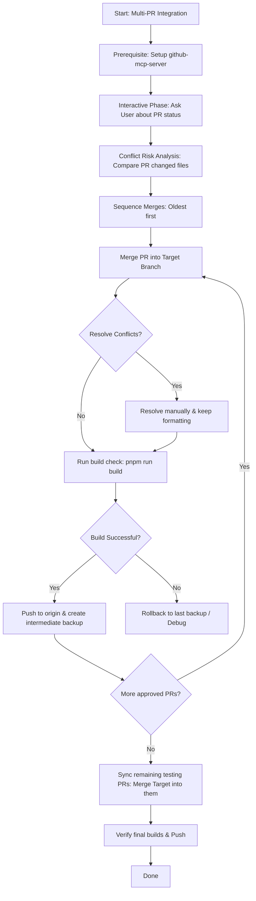

# Workflow: Safe Multi-PR Integration & Conflict Prevention

This workflow details the step-by-step process of merging multiple parallel Pull Requests into a target branch (e.g., `develop`) safely. It emphasizes proactive conflict analysis, incremental backup checkpoints, and automated build verification.



---

## 1. Prerequisites: GitHub MCP & Git Configuration

Before executing any commands, the agent must check if it has access to the `github-mcp-server`.

- **Why is GitHub MCP critical?**
  It allows the agent to fetch real-time PR metadata, draft statuses, and—most importantly—retrieve the list of modified files in each PR before doing any local branch checkout. This lets us run automated conflict analysis *before* running any destructive git actions.
- **How to verify & set up GitHub MCP:**
  Check the available MCP servers in your environment. If `github-mcp-server` is not active:
  - Ask the user to configure the `github-mcp-server` in their MCP settings (e.g., using their GitHub Personal Access Token `GH_PAT`).
  - *Fallback*: If the user cannot configure the GitHub MCP server, proceed using standard Git CLI commands to inspect remote branches (`git log`, `git diff`), but alert the user that file-level conflict preview is more restricted.

---

## 2. Interactive Discovery Phase

The agent must prompt the user to clarify the state of the workspace. **Ask the user the following questions before proceeding:**

1. **Target Branch**: Which branch are we merging into? (Usually `develop` or `main`).
2. **Implicated PRs**: What are the PR numbers and branch names of the active PRs?
3. **PR Status**: Which PRs are approved and fully ready to be merged? Which PRs are still in testing or draft status (meaning they should only be updated with the merged target branch later, but *not* merged into the target branch now)?
4. **Safety Checkpoints**: Do they want to create specific backup branch names (e.g. `backup/develop-before-merges`)?

---

## 3. Proactive Conflict Risk Analysis

Before merging, use the GitHub MCP server or Git CLI to map out conflict points:

1. **Get PR Changed Files**:
   - For each PR, execute the MCP tool `pull_request_read` with method `get_files` to retrieve the list of files modified.
   - If MCP is unavailable, use local Git to diff the branches against the target: `git diff --name-only origin/[target-branch]...origin/[feature-branch]`.
2. **Detect Overlaps**:
   - Compare the list of modified files across all PRs.
   - Files modified by more than one PR (e.g., `src/middleware.ts`, `tailwind.config.ts`, shared schemas) are **High Conflict Risk** elements.
   - Document these risk areas and present them to the user.

---

## 4. Execution Cookbook

Follow these sequential steps to ensure absolute codebase integrity.

### Step A: Sync and Initial Backup
Sync the local repository and create a baseline backup of the target branch:
```bash
# Fetch latest references
git fetch --all

# Ensure you are on the target branch and fully synced
git checkout develop
git pull origin develop

# Create a baseline backup branch
git checkout -b backup/develop-before-merges
git checkout develop
```

### Step B: Merge in Chronological Order
Sort approved PRs chronologically (oldest first). For each approved PR:

1. **Merge the Feature Branch**:
   ```bash
   git merge origin/feature/[branch-name] --no-ff -m "Merge PR #[number]: [title] into develop"
   ```
2. **Resolve Conflicts (If Any)**:
   - Carefully review conflict markers (`<<<<<<<`, `=======`, `>>>>>>>`).
   - Retain imports and structural rules from both branches. Do not drop critical functions or hooks.
   - Refer to `.agents/rules/` to ensure code style remains compliant.
3. **Verify Build Locally**:
   Run the project's build command to ensure nothing is broken:
   ```bash
   pnpm run build
   # or npm run build / yarn build
   ```
4. **Push and Save Progress**:
   - If the build passes, **push to origin immediately**:
     ```bash
     git push origin develop
     ```
   - Create an **intermediate backup branch** to lock in this progress:
     ```bash
     git checkout -b backup/develop-after-pr[number]
     git checkout develop
     ```
     *Rationale*: If a subsequent PR merge breaks the build or introduces complex conflicts, we can easily roll back to `backup/develop-after-pr[number]` and resume from there, without losing the successful merges already completed.

### Step C: Update In-Progress/Testing PRs
For the PRs that are *not* ready to merge yet (e.g., still in testing or draft status):

1. **Checkout the Feature Branch**:
   ```bash
   git checkout feature/[testing-branch-name]
   git pull origin feature/[testing-branch-name]
   ```
2. **Merge the Updated Target Branch**:
   ```bash
   git merge develop -m "Sync with latest develop branch after PR merges"
   ```
3. **Resolve Conflicts & Verify**:
   - Resolve any conflicts arising from the new code in `develop`.
   - Run the local build to ensure compatibility:
     ```bash
     pnpm run build
     ```
4. **Push Back to Origin**:
   ```bash
   git push origin feature/[testing-branch-name]
   ```
   *Result*: This PR is now conflict-free and fully updated with all recently merged PRs, making its future merge seamless once testing finishes.

---

## 5. Verification Checklist

At the end of the process, verify the integration:
- [ ] Run `git log --oneline --graph --all -n 20` to verify a clean git graph history.
- [ ] Run the final production build `pnpm run build` from the target branch.
- [ ] Ensure all local test suites pass successfully.
- [ ] Confirm with the user that the remote repository matches the local state.
