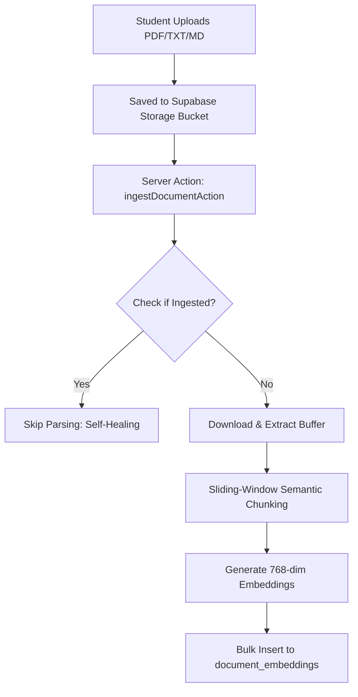
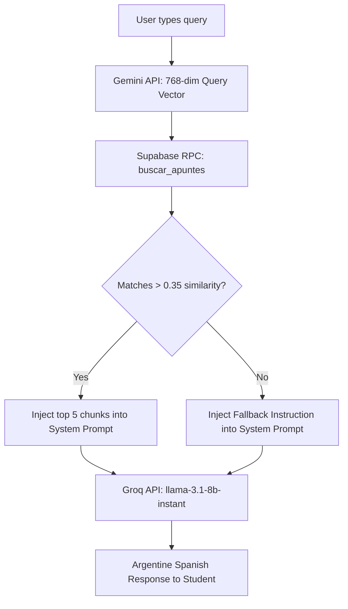

# UNLaR-Connect — Local RAG & AI Pipeline

UNLaR-Connect incorporates a highly efficient **Retrieval-Augmented Generation (RAG)** pipeline. This feature lets students upload their academic documents (PDF, TXT, MD) and instantly chat with them using semantic AI capabilities.

---

## 1. Document Ingestion Lifecycle

### Step 1: Upload and Database Reference
- The student uploads a document via the drag-and-drop React interface.
- The document is saved in the Supabase Storage Bucket `apuntes` and a catalog row is inserted into the `public.documents` table.

### Step 2: Server-Side Ingestion (`ingestDocumentAction`)
- When the document ingestion is triggered, the Server Action downloads the file buffer directly from Supabase Storage.
- **Self-Healing Check**: If embeddings already exist for the document ID in `document_embeddings`, the action skips processing to save API costs.

### Step 3: Plain Text Extraction
- **PDF**: Handled server-side using the `pdf-parse` library loaded dynamically.
- **TXT / MD**: Converted directly to UTF-8 strings.

### Step 4: Semantic sliding-Window Chunking
- The extracted text is normalized to remove duplicate whitespace and split into overlapping chunks:
  - **Chunk Size**: `700` characters.
  - **Overlap**: `150` characters.
- **Coherence Preservation**: Rather than cutting words or sentences in half, the chunker searches the last 100 characters of each chunk for sentence boundaries (`.!?` followed by whitespace). If none are found, it splits at the last word boundary (whitespace).

### Step 5: Embedding Generation (Google Gemini)
- Each text chunk is sent to the **Google Gemini REST API (`text-embedding-004`)** to generate a **768-dimension vector**.
- *API Stability & Fallback*: If the Gemini API key is missing or encounters issues, the system logs warnings and falls back to a zero-filled vector placeholder to guarantee database transactional compliance.

### Step 6: Bulk Storage (pgvector)
- The compiled database records are batch-inserted into `public.document_embeddings` in a single transaction.

---

## 2. Vector Similarity Retrieval & Chat

When a user chats within a filtered document panel or in the global chat, the matching pipeline retrieves context chunks dynamically.

### A. Vector Similarity Search (`buscar_apuntes`)
- The user's text message is converted into a 768-dimension embedding vector on the fly using Gemini.
- A custom PostgreSQL RPC function, `buscar_apuntes`, calculates the cosine similarity between the query vector and the document chunks:
  - **Similarity Threshold**: `0.35`.
  - **Match Count**: Up to `5` matching chunks.
  - **Categorization Filters**: Chunks are dynamically filtered by `document_id`, `subject_id`, `topic_id`, or `document_type` depending on the student's active panel state.

### B. System Prompt Construction & Tone Enforcement
The Server Action (`sendChatMessageAction`) compiles a specialized system prompt enforcing the following guidelines:
1. **Rioplatense Spanish (Voseo)**: Explicitly commands the LLM to speak like a fellow university classmate using Argentine Spanish voseo (*"tenés"*, *"mirá"*, *"querés"*). Standard neuter terms (*"tú"*, *"tienes"*) are strictly forbidden.
2. **Context Integration**:
   - If chunks exist, they are appended under the `CONTEXTO RELEVANTE` section.
   - A list of actual, cataloged documents is injected under the `APUNTES REALES` section. The assistant is instructed never to invent references.
3. **RAG Fallback Directives**:
   - If no semantic chunks match above the similarity threshold, the assistant falls back to a friendly, localized statement: *"Che, no encontré nada específico sobre eso en este apunte. ¿Querés que busquemos en internet o en otro documento?"*

### C. Chat Completion (Groq API)
- The system prompt, the injected context, and the full chat history are posted to **Groq REST API** utilizing **Llama 3.1 8B Instant (`llama-3.1-8b-instant`)** with a temperature of `0.7` for natural conversational responses.

---

> [!TIP]
> The similarity threshold (`0.35`) is optimized for Spanish academic material. For highly specialized technical literature, it can be adjusted within `src/actions/chat.ts`.
